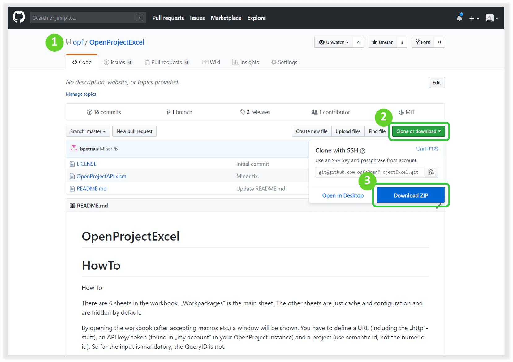
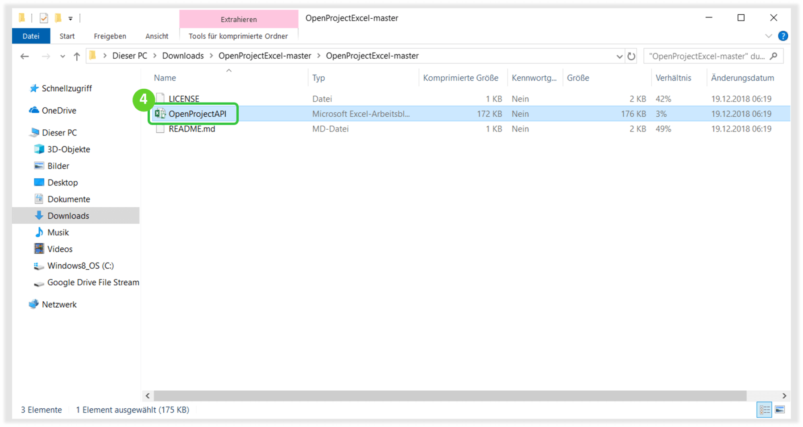
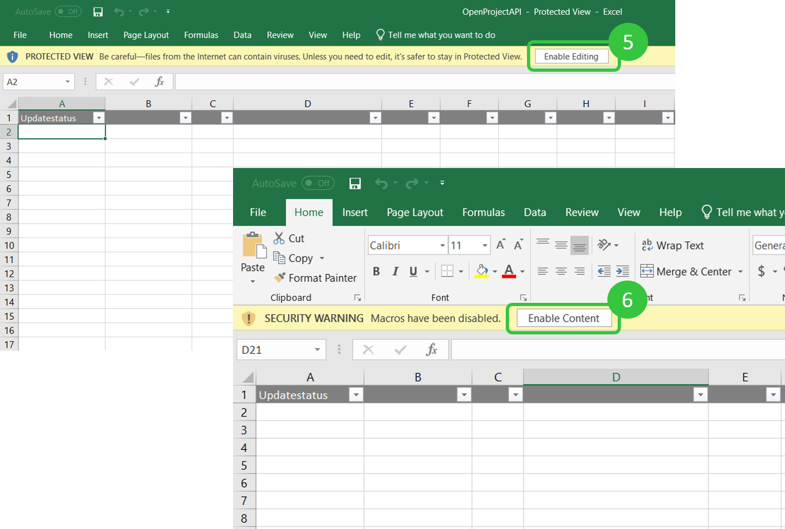
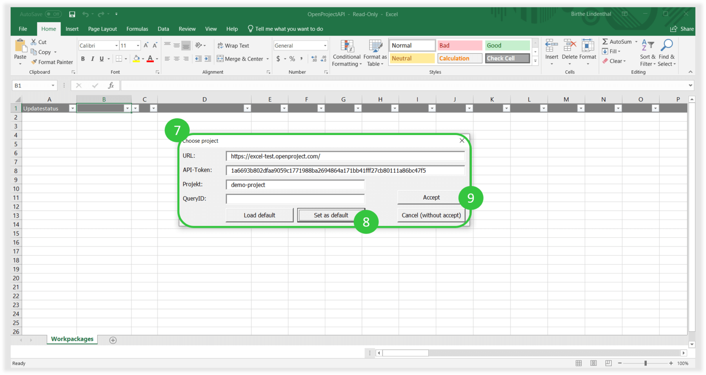
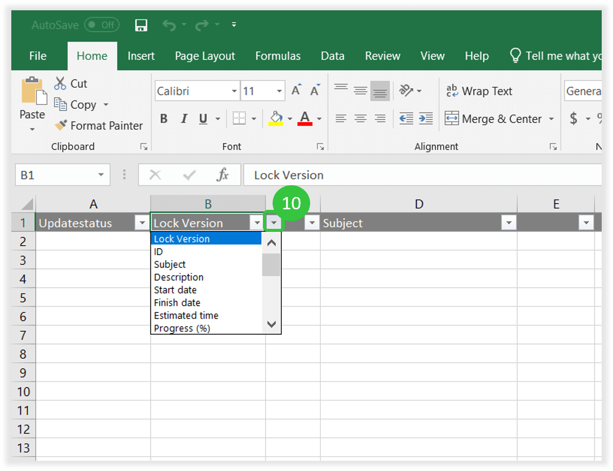
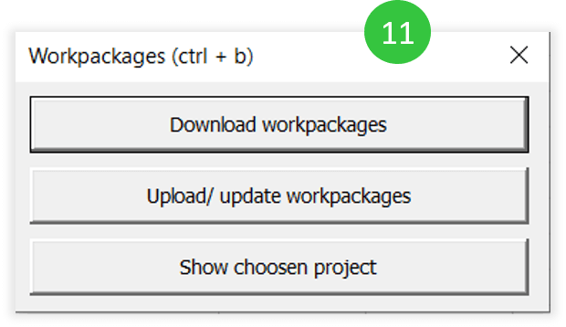
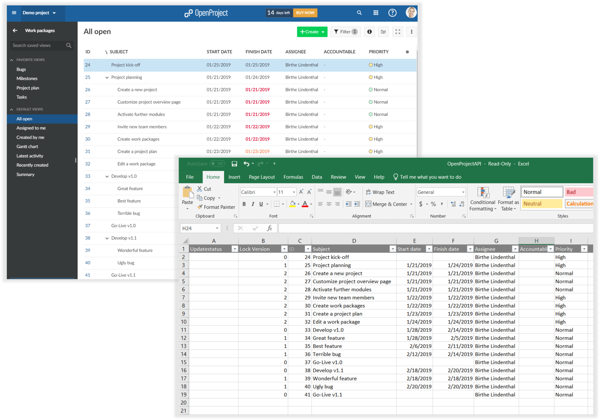
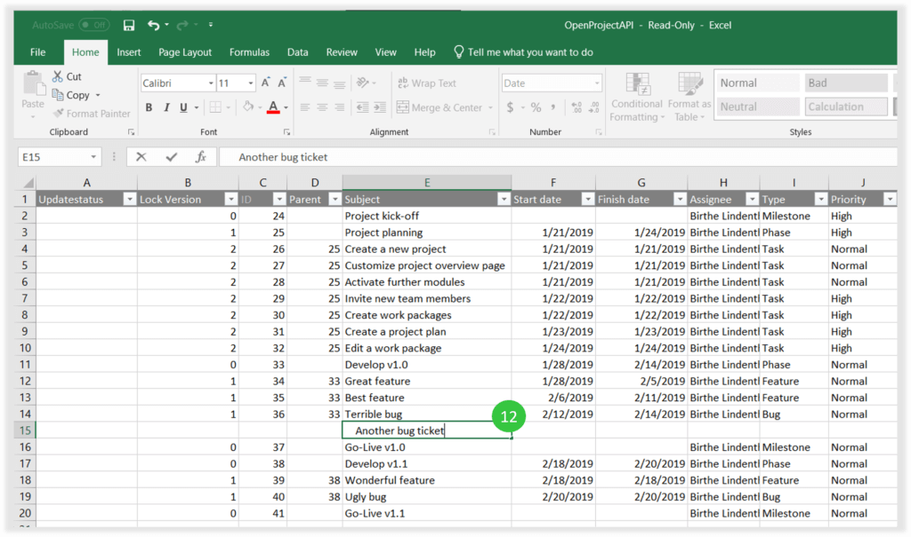
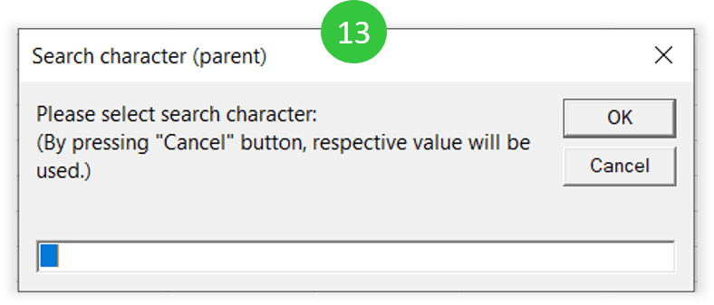
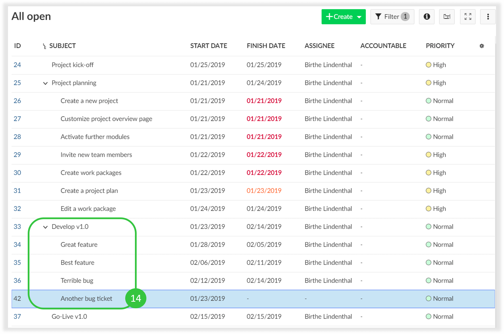

---
sidebar_navigation:
  title: Excel synchronization
  priority: 599
description: Excel synchronization with OpenProject
keywords: Excel
---
# Excel synchronization with OpenProject

## Video tutorials

### Download and upload

See how to set up the synchronization between OpenProject work packages and MS Excel.

<video src="https://openproject-docs.s3.eu-central-1.amazonaws.com/videos/OpenProject-Excel-synchronization-1.-download-and-upload.mp4" type="video/mp4" controls="" style="width:100%"></video>

### Synchronize custom queries (views)

See how to synchronize custom work package queries from OpenProject in MS Excel.

<video src="https://openproject-docs.s3.eu-central-1.amazonaws.com/videos/OpenProject-Excel-Synchronization-2.-custom-queries.mp4" type="video/mp4" controls="" style="width:100%"></video>

### Synchronize hierarchies

See how to synchronize work package hierarchies in OpenProject with MS Excel.

<video src="https://openproject-docs.s3.eu-central-1.amazonaws.com/videos/OpenProject-Excel-synchronization-3.-hierarchies.mp4" type="video/mp4" controls="" style="width:100%"></video>

### Synchronize relations

The OpenProject Excel synchronization also supports relations. To update the relations try the following steps:

1. Open the Excel file.
2. Prepare the headline (choose "*Relations" from drop-down).
3. Close the file (don't forget to save before).
4. Open the file and download the work packages.

You will then get the relations in your Excel file.

**Syntax:**
{type of relation} {id}, {type of relation} {id}, etc.

**Example:**
"follows 12345, precedes 45678"

Unfortunately, there is no way to create relation with translated terms via API at the moment. You have to use these terms instead: [Relation Edit Form API](../../../api/endpoints/relations/#relation-edit-form)

<video src="https://openproject-docs.s3.eu-central-1.amazonaws.com/videos/OpenProject-Excel-Relations.mp4" type="video/mp4" controls="" style="width:100%"></video>

## Step-by-step guide

### Setting-up the Excel list

1. In order to upload your tasks from an existing Excel list to OpenProject, you need to go to [OpenProjectExcel on GitHub.](https://github.com/opf/OpenProjectExcel)

2. Click on the green **Clone or download** button.

3. Choose the option **Download ZIP**.

   

4. Then, you need to extract the ZIP file and open the **OpenProjectAPI** Excel document.

5. Next, within the Excel document you are asked to **Enable Editing.**

6. Enable **Content** to activate macros within your document.

7. Enter settings (URL and API-Token) and choose a project (and  optional a work package query) which you want to synchronize your data  with.

**URL**: the URL of your OpenProject instance.
 **API-Token**: can be generated within your OpenProject installation ->*My Account* -> *Access token*. Generate a new API token and copy & paste it to this form.
 **Project**: this is the project identifier which can be found within the project you want to synchronize -> *Project settings* -> *Information*. It is also shown in the URL if you open a project.
 Query ID (this field is optional): enter the ID of a work package query  within a project with that you want to synchronize your Excel list.

8. Set as default: enable to remember the settings as default.

9. Accept to start the synchronization.

10. You need to select a minimum of columns to start with the  synchronization. For column selection, click in the header and open the  drop down which opens next to the regular drop down icon: Select the  following column headers at a minimum:
     **Update status**
     **Lock Version**
     **ID**
     **Subject**

Additionally, you can select as many other columns that should be  synchronized – always by clicking in the header and selecting the drop  down icon which appears next to the regular icon. You will have all  fields available, incl. custom fields.

**Important**: make sure you have all fields that need to be synchronized from your Excel list also available in OpenProject. **Some might be [created beforehand as custom fields](../../../system-admin-guide/custom-fields/) in OpenProject.**
 Attributes that do not exist in the selected project within OpenProject  are NOT available in the headline. They cannot be selected in the header (via the drop-down). Neither can you just create a new column with an  attribute that does not exist in OpenProject. This will generate an  error message.

Copy and paste all data accordingly from your existing Excel list to this sheet.

11. Important: **Ctrl + B** will open the synchronization module to choose between the following options:

**Download work packages**: initially downloads all work packages from the selected project (and query).
 **Upload / update work packages**: makes changes to the  work packages, e.g. adding new work packages or changing any information. This option needs to be chosen in order to initially import and  existing Excel list.
 **Show chosen project**: Opens the settings to adapt URL, API key, project or query ID.

Congratulations! You can now synchronize your data between Excel and OpenProject.

12. To synchronize hierarchies (Parent and child relations), insert the column **Parent** within the header of the Excel Sheet as described above (screen 10).

To add or edit a new parent-child relation, you have two possibilities:

**A)** You can add a child to a work package when you enter 4 empty spaces (press 4x Space) before typing the subject of the child work package.

**Expert tip**: it does not have to be empty spaces  (default 4 empty spaces) to separate the next hierarchy. You can also  take a „-“ and for the next hierarchy „—“. But the disadvantage is that  the hyphen will also be displayed in the work package subject. Therefore we recommend the spaces, because they will not appear in OpenProject.

13. Pressing **Ctrl + B** and selecting **Upload / update work packages** will open a window to define a new character for setting a parent-child-relationship (default is 4 empty spaces).

Click *OK* when the screen for the Search characters (screen 13) appears. The IDs in the *Parent* column will then be automatically updated.

Pressing **Cancel** will ignore the Hierarchy – no matter what has been inserted. This is relevant for option B:

**B)** you can edit the IDs in the parent column manually. If you have edited the IDs manually in the parent column, just click *Cancel* when the above Search character option (screen 13) appears. Then, the  hierarchy will be updated according to the IDs in the column *Parent*.

14. The parent-child-relation will be displayed in OpenProject.

Hopefully, this will save you lots of time to import all your old  Excel To-Do lists and get started with OpenProject for project  management.
