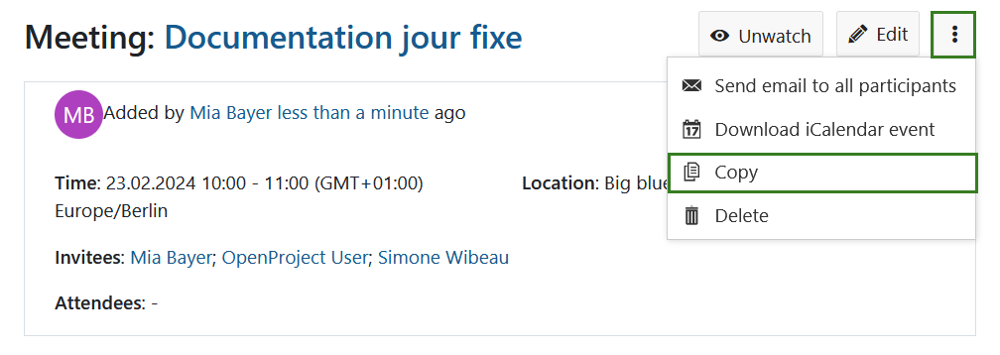

---
sidebar_navigation:
  title: Classic meetings
  priority: 900
description: Manage meetings with agenda and meeting minutes in OpenProject.
keywords: meetings, classic meetings, agenda, minutes
---

# Classic meetings

Meetings in OpenProject allow you to manage and document your project meetings, prepare a meeting agenda together with your team and document and share minutes with attendees, all in one central place.

**Meetings** is defined as a module that allows the organization of meetings. The module has to be activated in the project settings in order to be displayed in the side navigation.

> *Note:* [Dynamic meetings](../dynamic-meetings) were introduced in OpenProject 13.1. At the moment, the Meetings module lets you create classic or dynamic meetings but please keep in mind that the ability to create classic meetings will eventually be removed from OpenProject.

| Topic                                                                     | Content                                     |
|---------------------------------------------------------------------------|---------------------------------------------|
| [Meetings in OpenProject](#meetings-in-openproject)                       | How to open meetings in OpenProject.        |
| [Create a new meeting](#create-a-new-meeting)                             | How to create a new meeting in OpenProject. |
| [Edit a meeting](#edit-a-meeting)                                         | How to edit an existing meeting.            |
| [Add meeting participants](#add-meeting-participants)                     | How to invite people to a meeting.          |
| [Create or edit the meeting agenda](#create-or-edit-the-meeting-agenda)   | How to create or edit the agenda.           |
| [Copy a meeting (recurring meetings)](#copy-a-meeting-recurring-meetings) | How to create recurring meetings.           |

## Meetings in OpenProject

By selecting **Meetings** in the project menu on the left, you get an overview of all project meetings sorted by date. By clicking on a meeting name you can view further details of the meeting.

**Note:** In order to be able to use the meetings plugin, the **Meetings module needs to be activated** in the [Project Settings](../../projects/project-settings/modules/).

## Create a new meeting

1. To create a new meeting, click the green **+ Meeting** button in the upper right corner.
2. Enter your meeting title.
3. Choose 'Classic meeting'.
3. Enter meeting information, such as location, start date and duration.
5. Select the meeting participants from the project members list.
6. Click the **Create** button to save your changes.

## Edit a meeting

If you want to change the details of a meeting, for example its time or location, open the meetings details view by clicking on the title in the overview list and click on **Edit** next to the meeting’s name.

An edit screen is displayed and the meeting information can be adjusted.

Do not forget to save the changes by clicking the blue **Save** button. Cancel will bring you back to the details view.

## Add meeting participants

You can **add participants** (Invitees and Attendees) to a meeting while being in the [edit mode](#edit-a-meeting). The process is the same whether you are creating a new meeting or editing an existing one. Additionally you can record after the meeting who actually took part in it.

You can see the list of all the project members under **Participants**. This list varies from project to project. If you select the field in the columns Invitees or Attendees, the selected project members will be notified automatically when an agenda or a meeting protocol is created.

By removing the check mark you can remove project members from the meetings.

Click on the **Save** button to secure the changes made by you.

## Create or edit the meeting agenda

After creating a meeting, you can set up a **meeting agenda**.

1. Prior to starting the meeting all participants can add their input to the agenda by simply clicking the **Edit** button.
2. With the tool-bar, you can make changes to the text format or edit macros, e.g. table of contents or work package tables (see the [documentation for the WYSIWYG editor](../../wysiwyg) for details).
3. Do not forget to **save** your changes.
4. All changes made to the agenda are tracked. You can click the **History** button to get an overview of all the changes including the persons who made the changes.
5. Click the **Send for review** button to quickly notify participants about the meeting and send them a link to the meeting.
6. Press the **Send iCalendar** button to send a calendar entry to the participants. The users can then quickly add the meeting to their calendar by accepting the invitation / importing the iCal file attached to the email notification.
7. At the beginning of the meeting, **Close** the agenda to prevent any other changes and provide the same basis for all meeting participants. After closing the agenda, the meeting minutes are displayed to capture the results of the meeting.

## Create or edit meeting minutes

The **meeting minutes** are automatically created when closing the agenda in the details view of the meeting and selecting the [Close](#create-or-edit-the-meeting-agenda) option.

The agenda is closed and copied to the meeting minutes page as a basis. You can start editing the minutes now. The same way as in the [wiki](../../wiki) pages, you can format the text, link minutes to work packages, documents and include [work package lists or other macros](../../wysiwyg/#embedding-of-work-package-attributes-and-project-attributes).

You will be directed to the meeting view, where you can

1. edit the minutes (do not forget to **save** your data),
2. view the change history,
3. send the minutes for review to invitees and attendees (as well as watchers and the meeting’s author).

## Copy a meeting (recurring meetings)

If you have recurring meetings, such as a Jour Fixe, and want to simplify the process of creating meetings and agendas, you can **copy an existing meeting**. To do that select the meeting and open the detailed meeting view.

Select **Copy** in the upper right corner.

You can now edit the copied meeting and add the new details. Click the **Save** button to secure your changes.

> **Note**: all the settings will be copied, except for the minutes, participants and meeting history. So if you want to keep the minutes as well, you have to copy it separately.

